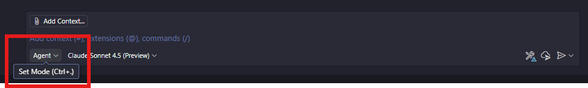

# 01: Create Copilot Instructions

## Scenario

You're starting a new project (Expense Tracker, Weather App, KYC Portal, or 360° Customer View) and want to ensure GitHub Copilot provides suggestions that align with your team's coding standards and technology stack. 

By creating a custom `.github/copilot-instructions.md` file, you'll guide Copilot to generate code that follows your project-specific conventions, security requirements, and architectural patterns. This ensures consistency across your codebase and helps Copilot understand your project context better.

## Prerequisites

- Completed [Lab 00: Setup & Configuration](./00-setup.md)
- GitHub Copilot is active in Agent Mode
- Chosen your project scenario (Expense Tracker, Weather App, KYC Portal, or 360° Customer)
- GitHub Codespaces or VS Code open

## Getting Started

- [Check GitHub Copilot Agent Mode](#check-github-copilot-agent-mode)
- [Set Up Project Environment](#set-up-project-environment)
- [Create Copilot Instructions File](#create-copilot-instructions-file)
- [Customize Instructions for Your Scenario](#customize-instructions-for-your-scenario)
- [Test Your Custom Instructions](#test-your-custom-instructions)
- [Verify Instructions Are Working](#verify-instructions-are-working)

---

## Check GitHub Copilot Agent Mode

1. Click the GitHub Copilot icon on the top of GitHub Codespace or VS Code and open GitHub Copilot window.

   

1. If you're asked to login or sign up, do it. It's free of charge.

1. Make sure you're using **GitHub Copilot Agent Mode**.

   

1. Select model to either `GPT-4.1` or `Claude Sonnet 4`.

1. Make sure that you've configured [MCP Servers](./00-setup.md#set-up-mcp-servers).

---

## Set Up Project Environment

### Step 1: Set Repository Root Environment Variable

Set the environment variable to easily reference your repository root.

```powershell
# PowerShell
$REPOSITORY_ROOT = git rev-parse --show-toplevel
```

```bash
# bash/zsh
REPOSITORY_ROOT=$(git rev-parse --show-toplevel)
```

### Step 2: Create Project Directory Structure

1. Open GitHub Copilot Chat in Agent Mode.

1. Use the prompt below to create your initial project structure:

   ```text
   I'm starting a new project. Follow the instructions below.
   
   - My scenario is: [Choose: Expense Tracker | Weather App | KYC Portal | 360 Customer View]
   - My tech stack is: [Choose: JavaScript/Node.js + React | Python + Flask | .NET + Blazor]
   - Create the following directory structure:
     - .github/ (for Copilot instructions)
     - src/ or backend/ (for backend code)
     - frontend/ (for frontend code if full-stack)
     - tests/ (for test files)
   - Create a README.md with project title and brief description
   - Initialize package.json (Node.js) OR requirements.txt (Python) OR .csproj (.NET)
   - List all steps you're going to perform first, then execute them
   ```

1. Review the steps GitHub Copilot Agent proposes.

1. Click the  button to accept the changes.

---

## Create Copilot Instructions File

### Step 1: Analyze Your Project Requirements

1. Make sure you're using GitHub Copilot Agent Mode with the model of `Claude Sonnet 4` or `GPT-4.1`.

1. Make sure that the `context7` MCP server is up and running (if you configured it in Lab 00).

1. Use the prompt below to analyze your project and prepare for instructions:

   ```text
   I need to create a custom Copilot instructions file for my project. Follow the instructions below.
   
   - Analyze my current project structure
   - Identify the tech stack (languages, frameworks, libraries)
   - Identify the project type and scenario
   - List what should be included in the Copilot instructions based on my scenario
   - Show me the recommendations before creating the file
   ```

1. Review Copilot's analysis and recommendations.

### Step 2: Generate Copilot Instructions File

1. Use the prompt below to create the `.github/copilot-instructions.md` file:

   ```text
   Create a .github/copilot-instructions.md file for my project. Follow the instructions below.
   
   - Use the analysis from the previous step
   - Create the .github directory if it doesn't exist
   - Generate comprehensive Copilot instructions including:
     1. Project overview and purpose
     2. Tech stack and versions
     3. Project structure and architecture
     4. Coding standards and conventions
     5. Security and validation requirements
     6. Testing approach and frameworks
     7. Error handling patterns
     8. Documentation standards
     9. Performance considerations
     10. Specific guidelines for my chosen scenario
   - Make instructions specific to my project, not generic
   - Include examples where helpful
   - Create the file and show me the content
   ```

1. Review the generated `copilot-instructions.md` file.

1. Click the  button to accept the changes.

---

## Customize Instructions for Your Scenario

### Step 3: Add Scenario-Specific Guidelines

Based on your chosen scenario, use the appropriate prompt below:

#### For Expense Tracker

```text
Update .github/copilot-instructions.md with specific guidelines for the Expense Tracker scenario. Add:

- Expense validation rules (amount > 0, valid categories, date validation)
- Category management (predefined categories: Food, Transport, Entertainment, Shopping, Bills, Other)
- Data structure for expenses (id, amount, category, description, date)
- Monthly summary and filtering requirements
- Error handling for invalid inputs
- API endpoint patterns (/api/expenses, GET/POST/DELETE)
- Currency formatting (always 2 decimal places)
- Date handling (ISO 8601 format)
```

#### For Weather App

```text
Update .github/copilot-instructions.md with specific guidelines for the Weather App scenario. Add:

- Weather API integration patterns (OpenWeatherMap or WeatherAPI)
- Caching strategy for API responses (cache for 30 minutes)
- Error handling for API failures and network issues
- Location input validation and geocoding
- Data structure for weather data (temperature, humidity, conditions, forecast)
- Rate limiting considerations (respect API limits)
- Environment variable usage for API keys (never hardcode)
- Unit conversion (Celsius/Fahrenheit, km/h vs mph)
```

#### For KYC Portal

```text
Update .github/copilot-instructions.md with specific guidelines for the KYC Portal scenario. Add:

- Document upload security (file type validation, size limits, virus scanning)
- Multi-step verification workflow (Document Upload → OCR/Validation → Manual Review → Approval)
- Data privacy and GDPR compliance requirements
- Audit trail logging (who, what, when for all actions)
- Document verification status tracking (Pending, In Review, Approved, Rejected)
- Secure file storage patterns (encrypted at rest)
- Role-based access control (Admin, Reviewer, User)
- PII data handling (mask sensitive data in logs)
```

#### For 360° Customer View

```text
Update .github/copilot-instructions.md with specific guidelines for the 360° Customer View scenario. Add:

- Data aggregation patterns from multiple sources (Profile, Transactions, Support, Compliance)
- Real-time update implementation (WebSocket or Server-Sent Events)
- Gambling compliance requirements (RG flags, responsible gaming limits, self-exclusion)
- Customer data structure (comprehensive profile with all touchpoints)
- Data synchronization and consistency (eventual consistency patterns)
- Performance optimization for large datasets (pagination, lazy loading, caching)
- Dashboard visualization requirements (charts, metrics, alerts)
- Responsible gaming (RG) indicators and alerts
```

1. Click the  button to accept the changes.

---

## Test Your Custom Instructions

### Step 4: Verify Instructions Work

1. Use the prompt below to test if Copilot is reading your instructions:

   ```text
   Based on my project's Copilot instructions, generate a sample function that:
   
   [Choose based on your scenario:]
   - [Expense Tracker] Creates a new expense with validation
   - [Weather App] Fetches weather data with caching
   - [KYC Portal] Handles document upload with security checks
   - [360° Customer] Aggregates customer data from multiple sources
   
   Make sure the generated code follows ALL the guidelines in copilot-instructions.md.
   Include:
   - Proper validation
   - Error handling
   - Documentation comments
   - Type definitions (if applicable)
   ```

1. Review the generated code and verify it follows your instructions:
   - ✅ Uses correct coding style and conventions
   - ✅ Includes proper error handling
   - ✅ Has validation as specified
   - ✅ Includes comments/documentation
   - ✅ Follows security guidelines

1. If the code doesn't follow your instructions, ask Copilot:

   ```text
   The generated code doesn't follow the guidelines in .github/copilot-instructions.md. Please:
   
   - Review the copilot-instructions.md file
   - Regenerate the code following ALL specified guidelines
   - Explain which guidelines you're applying
   ```

---

## Verify Instructions Are Working

### Step 5: Create a Test Component

1. Use this prompt to create a complete feature following your instructions:

   ```text
   Create a complete feature for my project following the copilot-instructions.md guidelines:
   
   [Choose based on your scenario:]
   - [Expense Tracker] Create expense validation service with tests
   - [Weather App] Create weather API service with caching and tests
   - [KYC Portal] Create document upload handler with security and tests
   - [360° Customer] Create customer data aggregation service with tests
   
   Include:
   1. Main implementation file in src/ or appropriate directory
   2. Test file with comprehensive test cases
   3. Type definitions or interfaces (if applicable)
   4. Error handling with proper error messages
   5. Documentation comments (JSDoc, docstrings, etc.)
   
   Follow ALL guidelines from copilot-instructions.md.
   List the files you'll create first, then create them.
   ```

1. Review the generated files:
   - ✅ File structure matches project conventions
   - ✅ Code follows naming conventions
   - ✅ Tests are included and comprehensive
   - ✅ Error handling is implemented
   - ✅ Documentation is present

1. Click the  button to accept the changes.

### Step 6: Build and Verify

1. Use this prompt to build and verify your code:

   ```text
   Build and verify the code I just created:
   
   - Install any necessary dependencies (npm install, pip install, dotnet restore)
   - Run the test suite
   - Fix any errors or issues that arise
   - Verify all tests pass
   - Show me the test results
   
   If there are any failures, fix them while maintaining copilot-instructions.md guidelines.
   ```

1. If there are build or test failures:

   ```text
   There are build/test failures. Please:
   
   - Analyze the error messages
   - Fix the issues while maintaining copilot-instructions.md guidelines
   - Run tests again to verify
   - Explain what was fixed and why
   ```

1. Click the  button once all tests pass.

---

## Best Practices for Copilot Instructions

### What Makes Good Instructions?

✅ **Do's:**

1. **Be Specific**: Instead of "use good naming", specify "use camelCase for variables, PascalCase for classes"
2. **Include Examples**: Show actual code examples of preferred patterns
3. **Cover Security**: Explicitly mention security requirements (input validation, sanitization, etc.)
4. **Specify Versions**: List framework and library versions to avoid deprecated patterns
5. **Document Architecture**: Explain how different parts of the app should interact
6. **Include Testing**: Specify testing frameworks, coverage requirements, and patterns
7. **Keep Updated**: Update instructions as your project evolves

❌ **Don'ts:**

1. **Don't Be Vague**: Avoid general statements like "write good code"
2. **Don't Overwhelm**: Keep instructions focused and relevant
3. **Don't Contradict**: Ensure guidelines don't conflict with each other
4. **Don't Forget Context**: Instructions should fit your actual project needs
5. **Don't Set and Forget**: Review and update instructions regularly

### Example of Good vs. Bad Instructions

**❌ Bad (Too Vague):**
```markdown
- Write clean code
- Use proper error handling
- Add tests
```

**✅ Good (Specific and Actionable):**
```markdown
- Use camelCase for variables and functions, PascalCase for classes
- All functions must validate inputs and return structured error objects: { success: boolean, error?: string, data?: any }
- Every function must have a corresponding Jest test file with minimum 80% coverage
- Use try-catch blocks for async operations and log errors using winston logger
```

---

## Troubleshooting

### Issue: Copilot Doesn't Follow Instructions

**Solution:**

1. Verify the file is at `.github/copilot-instructions.md` (exact location)
2. Check file has `.md` extension
3. Reload VS Code window (`Ctrl+Shift+P` → "Developer: Reload Window")
4. Explicitly reference instructions in your prompts: "Follow the guidelines in copilot-instructions.md"

### Issue: Instructions Are Too Generic

**Solution:**

Use this prompt to make them more specific:

```text
Review my .github/copilot-instructions.md file and make it more specific to my project:

- Add concrete examples for each guideline
- Include actual code patterns I should use
- Specify exact naming conventions with examples
- Add specific validation rules for my scenario
- Include error handling patterns with code examples
```

### Issue: Generated Code Doesn't Match Tech Stack

**Solution:**

Update instructions with explicit tech stack details:

```text
Update .github/copilot-instructions.md to be very explicit about my tech stack:

- Specify exact versions (e.g., Node.js 18.x, React 18.2, Express 4.x)
- List all major dependencies and their purposes
- Specify preferred libraries for common tasks (e.g., axios for HTTP, joi for validation)
- Add import/require patterns to use
- Include file naming conventions
```

---

## Next Steps

✅ **Lab 01 Complete!** You've created custom Copilot instructions for your project.

**What's Next:**

Proceed to [Lab 02: Custom Chat Modes](./02-custom-chat-modes.md) to create a specialized TDD chat mode that enforces test-first development.

**Optional Enhancements:**

1. **Add More Guidelines**: As you build your project, add more specific rules
2. **Create Examples**: Add a `/examples` folder with reference implementations
3. **Team Review**: Have team members review and suggest improvements
4. **Version Control**: Commit your instructions file to share with team

---

## Resources

- [GitHub Copilot Documentation](https://docs.github.com/en/copilot)
- [Copilot Instructions Best Practices](https://github.blog/2024-01-22-10-unexpected-ways-to-use-github-copilot/)
- Example Instructions:
  - [JavaScript Example](../docs/custom-instructions/javascript/copilot-instructions.md)
  - [Python Example](../docs/custom-instructions/python/copilot-instructions.md)
  - [.NET Example](../docs/custom-instructions/dotnet/copilot-instructions.md)

---

OK. You've completed Lab 01. Let's move onto [Lab 02: Custom Chat Modes](./02-custom-chat-modes.md).
