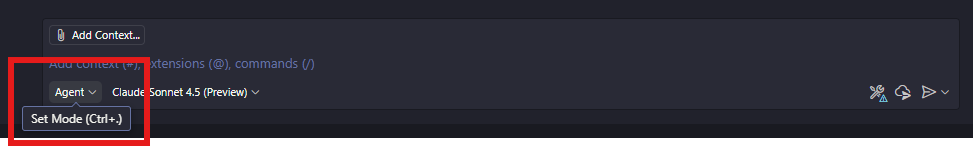

# 03: Playwright MCP Server for E2E Testing

## Scenario

You've built features for your application and now need comprehensive end-to-end (E2E) tests to ensure everything works together. Writing E2E tests from scratch is time-consuming and requires deep knowledge of testing frameworks.

By integrating the Playwright MCP (Model Context Protocol) server with GitHub Copilot, you can:
- Auto-generate E2E tests for your application
- Create tests using natural language descriptions
- Follow Page Object Model patterns automatically
- Generate selectors and test assertions
- Maintain comprehensive test coverage

In this lab, you'll set up the Playwright MCP server and use it to generate E2E tests for your chosen scenario.

## Prerequisites

- Completed [Lab 00: Setup & Configuration](./00-setup.md)
- Completed [Lab 01: Copilot Instructions](./01-copilot-instructions.md)
- GitHub Copilot is active in Agent Mode
- Node.js 18+ installed (for Playwright MCP server)
- Your project has a running application (frontend)

## Getting Started

- [Check GitHub Copilot Agent Mode](#check-github-copilot-agent-mode)
- [Install Playwright MCP Server](#install-playwright-mcp-server)
- [Configure Playwright MCP Server](#configure-playwright-mcp-server)
- [Install Playwright in Your Project](#install-playwright-in-your-project)
- [Generate E2E Tests with MCP](#generate-e2e-tests-with-mcp)
- [Create Page Object Models](#create-page-object-models)
- [Run and Verify E2E Tests](#run-and-verify-e2e-tests)

---

## Check GitHub Copilot Agent Mode

1. Click the GitHub Copilot icon on the top of GitHub Codespace or VS Code and open GitHub Copilot window.

   

1. Make sure you're using **GitHub Copilot Agent Mode**.

   

1. Select model to either `GPT-4.1` or `Claude Sonnet 4`.

---

## Install Playwright MCP Server

### Step 1: Install Playwright MCP Server Globally

1. Open a terminal in VS Code.

1. Install the Playwright MCP server:

   ```powershell
   # PowerShell
   npm install -g @microsoft/playwright-mcp-server
   ```

   ```bash
   # Bash/Zsh
   npm install -g @microsoft/playwright-mcp-server
   ```

1. Verify installation:

   ```powershell
   # PowerShell
   npm list -g @microsoft/playwright-mcp-server
   ```

   ```bash
   # Bash/Zsh
   npm list -g @microsoft/playwright-mcp-server
   ```

---

## Configure Playwright MCP Server

### Step 2: Add MCP Server to VS Code Settings

1. Make sure you're using GitHub Copilot Agent Mode with the model of `Claude Sonnet 4` or `GPT-4.1`.

1. Use the prompt below to configure the Playwright MCP server:

   ```text
   Configure the Playwright MCP server in my VS Code settings. Follow the instructions below.
   
   - Create or update .vscode/settings.json
   - Add MCP server configuration for Playwright
   - Use the global npm installation: "@microsoft/playwright-mcp-server"
   - Set command to: "npx"
   - Set args to: ["@microsoft/playwright-mcp-server"]
   - Show me the settings.json configuration
   ```

1. Review the generated configuration. It should look like:

   ```json
   {
     "github.copilot.chat.mcp.servers": {
       "playwright": {
         "command": "npx",
         "args": ["@microsoft/playwright-mcp-server"]
       }
     }
   }
   ```

1. Click the  button to accept the changes.

### Step 3: Reload VS Code

1. Reload VS Code to activate the MCP server:
   - Press `Ctrl+Shift+P` (or `Cmd+Shift+P` on Mac)
   - Type "Developer: Reload Window"
   - Press Enter

1. Verify the MCP server is running:

   ```text
   Check if the Playwright MCP server is running and available.
   
   - List all available MCP servers
   - Confirm Playwright server is active
   - Show me the server status
   ```

---

## Install Playwright in Your Project

### Step 4: Install Playwright

1. Use the prompt below to install Playwright in your project:

   ```text
   Install Playwright in my project for E2E testing. Follow the instructions below.
   
   - Use context7 if available
   - Install Playwright with appropriate package manager (npm, pip, or dotnet)
   - Choose the framework based on my tech stack:
     * JavaScript/Node.js: @playwright/test
     * Python: pytest-playwright
     * .NET: Microsoft.Playwright
   - Initialize Playwright configuration
   - Create initial project structure for tests
   - Show me the installation steps
   ```

1. Review the installation steps and configuration.

1. Click the  button to proceed.

### Step 5: Configure Playwright

1. Use this prompt to configure Playwright for your project:

   ```text
   Configure Playwright for my project. Follow the instructions below.
   
   - Create playwright.config.js (or .ts, .py based on language)
   - Set base URL to: http://localhost:3000 (or your app's URL)
   - Configure browsers: chromium, firefox, webkit
   - Set up test directory: e2e/ or tests/e2e/
   - Enable screenshot on failure
   - Enable video on first retry
   - Set up test reporter (HTML reporter recommended)
   - Show me the configuration file
   ```

1. Click the  button to save the configuration.

---

## Generate E2E Tests with MCP

### Step 6: Create Your First E2E Test

1. Make sure your application is running (or will be run during tests).

1. Use the Playwright MCP server to generate your first E2E test. Choose the prompt based on your scenario:

   **For Expense Tracker:**
   ```text
   Use the Playwright MCP server to generate an E2E test for my Expense Tracker app.
   
   Test scenario: "Add New Expense"
   
   Steps:
   1. Navigate to http://localhost:3000
   2. Fill in expense form:
      - Amount: "50.00"
      - Category: Select "Food"
      - Description: "Lunch at cafe"
      - Date: Today's date
   3. Click "Add Expense" button
   4. Verify expense appears in the expense list
   5. Verify total is updated
   
   Create the test file in e2e/ directory.
   Use Page Object Model pattern.
   Include proper assertions and error handling.
   ```

   **For Weather App:**
   ```text
   Use the Playwright MCP server to generate an E2E test for my Weather App.
   
   Test scenario: "Search Weather by City"
   
   Steps:
   1. Navigate to http://localhost:3000
   2. Find the city search input
   3. Enter "London"
   4. Click search button
   5. Wait for weather data to load
   6. Verify weather information is displayed:
      - City name "London"
      - Temperature is shown
      - Weather condition is shown
      - Humidity is shown
   
   Create the test file in e2e/ directory.
   Handle API loading states.
   Include error scenarios (invalid city).
   ```

   **For KYC Portal:**
   ```text
   Use the Playwright MCP server to generate an E2E test for my KYC Portal.
   
   Test scenario: "Upload Document for Verification"
   
   Steps:
   1. Navigate to http://localhost:3000
   2. Click "Upload Document" button
   3. Select document type: "Passport"
   4. Upload a test PDF file
   5. Enter document number
   6. Click "Submit for Verification"
   7. Verify document appears in "Pending Review" status
   8. Verify audit log entry is created
   
   Create the test file in e2e/ directory.
   Include file upload handling.
   Verify security checks are working.
   ```

   **For 360° Customer:**
   ```text
   Use the Playwright MCP server to generate an E2E test for my 360° Customer View.
   
   Test scenario: "View Customer Complete Profile"
   
   Steps:
   1. Navigate to http://localhost:3000
   2. Search for customer ID: "CUST-12345"
   3. Verify customer profile loads with:
      - Personal information
      - Recent transactions
      - Support tickets
      - Compliance flags (RG status)
   4. Check real-time updates (WebSocket connection)
   5. Verify all data sections are populated
   
   Create the test file in e2e/ directory.
   Handle async data loading.
   Verify real-time updates work.
   ```

1. Review the generated test file.

1. Click the  button to save the test.

---

## Create Page Object Models

### Step 7: Generate Page Objects

1. Use the Playwright MCP server to create Page Object Models:

   ```text
   Use the Playwright MCP server to generate Page Object Models for my application.
   
   Create page objects for:
   [Choose based on your scenario:]
   
   - [Expense Tracker] HomePage, AddExpensePage, ExpenseListPage
   - [Weather App] HomePage, SearchPage, WeatherDetailsPage
   - [KYC Portal] HomePage, DocumentUploadPage, VerificationDashboardPage
   - [360° Customer] HomePage, CustomerSearchPage, CustomerProfilePage
   
   Each page object should:
   1. Extend base Page class
   2. Include selectors as properties
   3. Include methods for user interactions
   4. Include assertion methods
   5. Follow Page Object Model best practices
   
   Create page objects in e2e/pages/ directory.
   Show me all the page object files.
   ```

1. Review the generated Page Object files.

1. Click the  button.

### Step 8: Refactor Tests to Use Page Objects

1. Update your E2E tests to use the Page Objects:

   ```text
   Refactor the E2E test to use the Page Object Models we just created.
   
   - Import the relevant page objects
   - Replace direct selectors with page object methods
   - Improve test readability
   - Add more assertions using page object assertion methods
   - Keep tests clean and maintainable
   
   Show me the refactored test.
   ```

1. Click the  button.

---

## Run and Verify E2E Tests

### Step 9: Run Playwright Tests

1. Make sure your application is running:

   ```text
   I need to run my application for E2E testing.
   
   - Start the development server (frontend)
   - Start the backend server if needed
   - Verify the app is accessible at the configured base URL
   - Show me the command to start the servers
   ```

1. Run the Playwright tests:

   ```text
   Run the Playwright E2E tests.
   
   - Execute the Playwright test suite
   - Run in headed mode first (so I can see what's happening)
   - Generate HTML report
   - Show me the test results
   
   If tests fail:
   - Analyze the failure reasons
   - Show screenshots (if available)
   - Suggest fixes
   ```

1. Review the test results.

### Step 10: Fix Failing Tests

1. If tests fail, use this prompt:

   ```text
   The E2E tests failed. Help me fix them.
   
   - Analyze the error messages
   - Check if selectors are correct
   - Verify timing issues (add appropriate waits)
   - Check if test data is valid
   - Fix the issues in the test files
   - Re-run the tests
   
   Show me what was fixed and why.
   ```

1. Click the  button after fixes.

1. Re-run tests until they all pass.

---

## Add More E2E Tests

### Step 11: Create Comprehensive Test Suite

1. Use the Playwright MCP server to generate additional tests:

   **For Expense Tracker:**
   ```text
   Use Playwright MCP server to generate additional E2E tests:
   
   Test 1: "Delete Expense"
   - Add an expense
   - Click delete button
   - Confirm deletion
   - Verify expense is removed from list
   
   Test 2: "Filter Expenses by Category"
   - Add multiple expenses with different categories
   - Select category filter "Food"
   - Verify only Food expenses are shown
   
   Test 3: "View Monthly Summary"
   - Add expenses for current month
   - Navigate to monthly summary
   - Verify total is calculated correctly
   - Verify category breakdown is shown
   
   Create all tests using Page Objects.
   ```

   **For Weather App:**
   ```text
   Use Playwright MCP server to generate additional E2E tests:
   
   Test 1: "Handle Invalid City"
   - Enter invalid city name "XYZ123"
   - Click search
   - Verify error message is displayed
   - Verify no weather data shown
   
   Test 2: "Cache Weather Data"
   - Search for a city
   - Note the request timestamp
   - Search same city again within 30 minutes
   - Verify cached data is used (no new API call)
   
   Test 3: "View 5-Day Forecast"
   - Search for a city
   - Verify 5-day forecast is displayed
   - Verify each day shows temperature and condition
   
   Create all tests using Page Objects.
   ```

   **For KYC Portal:**
   ```text
   Use Playwright MCP server to generate additional E2E tests:
   
   Test 1: "Reject Invalid Document"
   - Upload file with invalid type (.txt)
   - Verify error message about file type
   - Verify document is not submitted
   
   Test 2: "Document Verification Workflow"
   - Upload valid document
   - Login as reviewer
   - Review document
   - Approve document
   - Verify status changes to "Approved"
   - Verify audit trail is updated
   
   Test 3: "Document Size Validation"
   - Attempt to upload file > 10MB
   - Verify error message
   - Upload valid size file
   - Verify success
   
   Create all tests using Page Objects.
   Include role-based testing (Admin, Reviewer, User).
   ```

   **For 360° Customer:**
   ```text
   Use Playwright MCP server to generate additional E2E tests:
   
   Test 1: "Real-Time Transaction Update"
   - Open customer profile
   - Simulate new transaction (via API or mock)
   - Verify transaction appears in real-time
   - Verify total balance is updated
   
   Test 2: "Responsible Gaming (RG) Alert"
   - Open customer with RG flag
   - Verify RG warning is displayed
   - Verify limits are shown
   - Verify self-exclusion status
   
   Test 3: "Multi-Source Data Aggregation"
   - Open customer profile
   - Verify profile data loaded
   - Verify transactions loaded
   - Verify support tickets loaded
   - Verify compliance data loaded
   - Check loading states and error handling
   
   Create all tests using Page Objects.
   Test WebSocket/SSE connections.
   ```

1. Click the  button for each test.

---

## Best Practices for E2E Testing

### E2E Testing Best Practices

✅ **Do's:**

1. **Use Page Objects**: Encapsulate page interactions
2. **Test User Journeys**: Test complete workflows, not just individual actions
3. **Handle Async**: Use proper waits for dynamic content
4. **Independent Tests**: Each test should be independent
5. **Clean Up**: Reset state between tests
6. **Meaningful Assertions**: Verify actual user-visible behavior
7. **Screenshot Failures**: Capture screenshots for debugging

❌ **Don'ts:**

1. **Don't Use Sleeps**: Use proper waits instead of `sleep()`
2. **Don't Test Units**: E2E tests should test integration, not units
3. **Don't Hardcode**: Use configuration for URLs, credentials, etc.
4. **Don't Skip Cleanup**: Always clean test data
5. **Don't Ignore Flakiness**: Fix flaky tests immediately

---

## Troubleshooting

### Issue: MCP Server Not Available

**Solution:**

1. Verify installation:
   ```bash
   npm list -g @microsoft/playwright-mcp-server
   ```

2. Reload VS Code window

3. Check `.vscode/settings.json` configuration

4. Try re-installing:
   ```bash
   npm uninstall -g @microsoft/playwright-mcp-server
   npm install -g @microsoft/playwright-mcp-server
   ```

### Issue: Tests Are Flaky

**Solution:**

```text
My E2E tests are flaky (sometimes pass, sometimes fail). Help me fix this.

- Identify potential race conditions
- Add proper waits (waitForSelector, waitForLoadState)
- Replace fixed timeouts with event-based waits
- Check for timing-dependent assertions
- Suggest more stable selectors
- Show me the improved test code
```

### Issue: Selectors Keep Breaking

**Solution:**

```text
My test selectors keep breaking when UI changes. Help me create more stable selectors.

- Review current selectors
- Suggest data-testid attributes
- Use semantic selectors (role, label, text)
- Avoid fragile selectors (CSS classes, nth-child)
- Update Page Objects with stable selectors
- Show me the improvements
```

---

## Next Steps

✅ **Lab 03 Complete!** You've integrated Playwright MCP server for E2E testing.

**What's Next:**

Proceed to [Lab 05: Test-Driven Development](./05-tdd-with-copilot.md) to practice TDD workflow with your custom TDD mode.

**Note:** Lab 04 (.NET Migration) is optional and can be skipped.

**Optional Enhancements:**

1. **Visual Testing**: Add Playwright visual regression tests
2. **Accessibility Testing**: Use Playwright accessibility features
3. **Performance Testing**: Add performance assertions
4. **CI/CD Integration**: Run E2E tests in CI pipeline

---

## Resources

- [Playwright Documentation](https://playwright.dev/)
- [Playwright MCP Server GitHub](https://github.com/microsoft/playwright-mcp-server)
- [Page Object Model Pattern](https://playwright.dev/docs/pom)
- [Playwright Best Practices](https://playwright.dev/docs/best-practices)
- [E2E Testing Guide](https://martinfowler.com/articles/practical-test-pyramid.html)

---

OK. You've completed Lab 03. Let's move onto [Lab 05: Test-Driven Development](./05-tdd-with-copilot.md).
